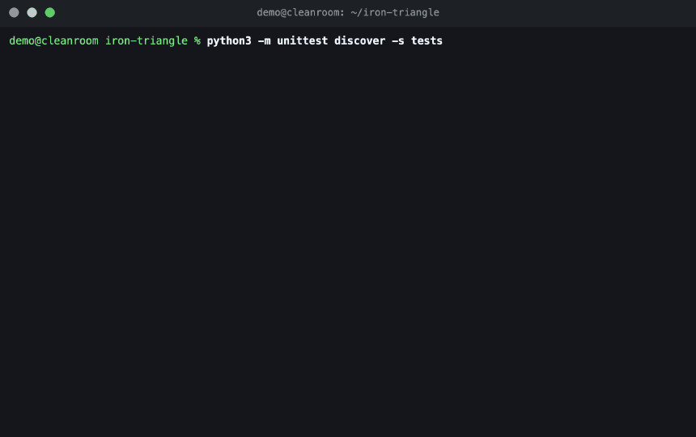

# Iron Triangle Protocol

让三个各有短板的模型，跑出比任何单一模型都可靠的长任务。

*Make three imperfect models deliver long-running work more reliably than any one of them could alone.*

**In long AI-run tasks, the executing model will claim unverified success or silently drift — and a chat transcript is the only record left.** Iron Triangle Protocol separates judgment, execution, and verification into three pluggable model roles, then makes an append-only paper trail — ledger, receipts, red lines, pre-decisions — the durable fourth member of the team. A "done" without a reproducible receipt cannot ship.

**长任务里，执行模型会宣称未经验证的成功，或者悄悄漂移——而聊天记录是唯一剩下的证据。** 铁三角协议把裁决、执行、验证拆成三个可插拔的模型角色，再用只追加的纸面协议（台账、收据、红线、预裁决）构成不会随窗口丢失的“第四成员”。没有可复现收据的“完成”不允许出厂。

- Protocol version: `1.0-draft` · Tool version: `0.3.0-rc.1` · License: MIT
- Evidence base: one four-day production field run. **No platform beyond the session-API runtime below is field-verified yet** — see the [support matrix](#support-matrix--支持矩阵) before relying on any adapter.
- 证据基础为一次四天实战。除下述会话 API 运行时外，其他适配路径均未经实战验证，依赖前先看[支持矩阵](#support-matrix--支持矩阵)。

Real terminal session — the 60-second quick start below, executed and recorded by [`scripts/make_release_assets.py`](scripts/make_release_assets.py) (reproducible; capture source committed at [`docs/assets/demo/session.cast.jsonl`](docs/assets/demo/session.cast.jsonl)):

真实终端会话——即下文 60 秒快速开始，由脚本实际执行并录制（可复现，录制源已入库）：

<a href="docs/assets/demo/session.cast.jsonl"></a>

## Quick start in 60 seconds / 60 秒快速开始

Zero-install path (Python 3.9+, standard library only):

```bash
git clone <this-repository> iron-triangle && cd iron-triangle   # or download
python3 -m unittest discover -s tests                            # verify the toolchain
cp examples/runtime-config.example.json ~/my-runtime.json        # private config, keep out of the repo
# edit ~/my-runtime.json: replace every <placeholder>
python3 scripts/iron_triangle_bridge.py --config ~/my-runtime.json doctor
```

Then, from any agent window that installed the skill, just say:

```text
铁三角：<task>
```

The window receiving the phrase is the arbiter. For the session-API runtime, dispatch and supervise with:

```bash
python3 scripts/iron_triangle_bridge.py --config ~/my-runtime.json preflight
python3 scripts/iron_triangle_bridge.py --config ~/my-runtime.json launch --cwd <workspace> --task '<task>'
python3 scripts/iron_triangle_bridge.py --config ~/my-runtime.json install          # supervised relay (launchd)
python3 scripts/iron_triangle_bridge.py --config ~/my-runtime.json status --pending
```

Language is automatic: no manual switch exists. The skill determines one `response_language` per run (an explicit user request wins; otherwise the task's dominant language) and passes it once — both role windows inherit it jointly. Catalog-backed languages (`en`, `zh-CN`) localize titles, contracts, and ledger/notification text; other recognized languages keep English machine fields while models reply in the requested language. `--language` remains as an explicit override or test interface.

中文路径：克隆后跑一遍测试确认工具链可用；复制示例配置到仓库之外并替换全部占位符；`doctor` 自检通过后，在装有技能的窗口说「铁三角：任务」，当前窗口即为主控；会话 API 运行时用上面的 `preflight → launch → install → status` 命令派发与监督。语言全自动：主控按用户显式要求（优先）或任务主要语言确定统一 `response_language` 并自动传参，执行者与审查者共同继承——中文语境全程中文、英文语境全程英文，无需手工开关；`--language` 仅作显式覆盖或测试接口。内置目录覆盖 zh-CN 与 en；其他识别语言保留英文机器字段与角色标签，但两个角色的自然语言回复明确跟随 `response_language`；运行中途切换由主控登记并对两角色同时生效。

## Why this exists / 为什么需要它

Unattended long tasks fail in repeatable ways: a relay looks alive but no review ever starts; an executor's API goes down mid-run; a reviewer only summarizes the executor's report; deployment proceeds with red tests; an internal health check stands in for the real user channel. Every one of these was observed in a real four-day production run — see [the founding field-run case study](docs/case-study-founding-field-run.md). The protocol's ten mechanisms are the controls distilled from those incidents; removing any one is a degraded mode that must be disclosed.

无人值守长任务的失效方式是可以枚举的：接力假死、执行端断供、审查者只转述、带红部署、内部探针冒充用户通道验收——每一条都来自一次真实的四天生产运行（见[实战案例研究](docs/case-study-founding-field-run.md)）。十条核心机制即由这些现场问题沉淀而来；缺任一条即为降级模式，必须显式披露。

## When to use / 何时启用

Explicit invocation wins: if the user says `铁三角`, `启动铁三角`, or `iron triangle`, activate the protocol immediately. The window receiving that phrase is the arbiter; its model brand is irrelevant. The two-of-four gate below is only for implicit recommendation when the user did not invoke the protocol:

- the work lasts at least one day or crosses sessions/windows;
- it includes production changes, irreversible actions, or a high risk of unverified success claims;
- it must continue unattended;
- expensive reasoning and high-throughput execution need separate budgets.

用户只要说出“铁三角”或“启动铁三角”，协议立即启用；收到口令的当前窗口就是主控，与模型品牌无关。“四条中至少两条”仅用于未点名协议时的自动建议；短任务仍由单模型直接完成。

## Architecture / 架构

| Role | Responsibility | Target budget |
|---|---|---:|
| Arbiter / 主控 | Decide, plan, set measurable acceptance lines; never investigate or execute | `<2%` |
| Executor / 执行者 | Investigate, implement, test, and deploy | `>90%` |
| Reviewer / 审查者 | Independently reproduce the critical checks from receipts | remainder |
| Paper protocol / 纸面协议 | Preserve ledger, receipts, red lines, pre-decisions, and recovery state | durable state |

Models are slots. The protocol is the asset. A weaker arbiter should be compensated with more conservative pre-decisions and a narrower autonomous scope—not by weakening evidence requirements.

模型只是插槽，协议才是资产。主控能力下降时，应收紧预裁决与自主授权范围，不能降低证据标准。

Honesty note: the `<2%` / `>90%` figures above are **targets**, not results. In the founding run the measured arbiter share was 2.554832% — the target was missed, and the recomputed numbers are published in the [case study](docs/case-study-founding-field-run.md).

诚实说明：上表 `<2%` / `>90%` 是**目标值**而非实测结果。实战中主控实测占比为 2.554832%——目标未达成，复算后的数字已发布在[案例研究](docs/case-study-founding-field-run.md)。

## Support matrix / 支持矩阵

Statuses: **verified** = exercised in the founding field run or by this repository's test suite; **awaiting-remote** = fully defined and locally rehearsed, needs one authorized remote execution (push/tag/CI) to become verified; **experimental** = implemented/generated and tested offline, not exercised against the real platform; **open question** = no verified mechanism exists yet.

| Capability | Status | Evidence |
|---|---|---|
| Session-API runtime bridge (Kimi Code style): bind/create, dispatch with ack, turn-ended events, crash resume | **verified** | four-day field run + `tests/test_bridge.py`, `tests/test_conformance.py` |
| Run narration language policy (`zh-CN` / `en` catalogs plus recognized third languages): automatic per-run `response_language` (explicit > config > task-script detection), jointly inherited by both roles | **verified** | `tests/test_language.py`; en path golden-locked byte-identical to v0.2; non-catalog languages fall back to English machine fields with an explicit reply-language directive |
| Security canary: every sanitizer rule trips on a planted fixture while the public tree scans zero | **verified** | `tests/test_security_canary.py`, `src/iron_triangle/sanitizer.py` |
| macOS launchd supervised relay (`install`/`uninstall`) | **verified (macOS)** | field run; dry-run plans tested cross-platform |
| Policy state machine fail-closed set (duplicate events, truncation, unknown delivery, restart) | **verified** | `tests/test_policy.py`, `tests/test_conformance.py` |
| Arbiter closure briefing (six side-by-side elements; continuation-authority boundary) as a hard skill requirement | **verified** | canonical skill §Arbiter closure briefing + briefing template; asserted across all five skills by `tests/test_skill.py` |
| Remote CI execution (GitHub Actions: ubuntu/macos/windows × Python 3.9/3.12) | **verified** | first all-green run: [32556149605](https://github.com/he62621-oss/iron-triangle-protocol/actions/runs/32556149605); latest `main` run green: [32557192924](https://github.com/he62621-oss/iron-triangle-protocol/actions/runs/32557192924); tagged-run green: [32557566761](https://github.com/he62621-oss/iron-triangle-protocol/actions/runs/32557566761); the first-ever run [32555578161](https://github.com/he62621-oss/iron-triangle-protocol/actions/runs/32555578161) **failed** on Windows and is retained as the discovery receipt for two real portability defects (both fixed); workflow pinned by `tests/test_release_gate.py` |
| Fresh-contributor smoke (Ubuntu/macOS, zero-install quickstart path) | **verified** | `fresh-contributor-smoke` jobs green in the same runs; wall time printed per job |
| Linux systemd unit generation + command plan | **experimental** | rendered output and dry-run plans tested in `tests/test_supervisor.py`; never run against systemd |
| Windows scheduled-task plan | **experimental** | generated `schtasks` command tested in `tests/test_supervisor.py`; never run against Task Scheduler |
| Interactive-window runtime (Cursor style) | **experimental** | sentinel/manual-paste mapping documented; no live exercise |
| Codex / Claude Code orchestration mappings | **experimental** | skill mappings shipped; bridge itself targets session APIs |
| Automatic reinjection into the originating controller window | **open question** | outbox + notification is the shipped manual path |
| Best default idle timeout; universal delivery-receipt schema | **open question** | `idle_wake_seconds` exists but defaults off |
| Native UI localization of third-party target apps | **open question** | outside runtime control; the runtime localizes only what it dispatches |

支持矩阵中：verified 为实战或本仓库测试覆盖；awaiting-remote 为已完整定义并本地演练、只差一次授权的远程执行（推送/打 tag/CI 首跑）；experimental 为已实现并离线测试但未对接真实平台；open question 为尚无已验证机制。除 macOS launchd与会话 API 桥外，请勿在生产依赖其他路径。远程 CI 首跑已全绿（见 Remote CI 行的 run 链接）；未经链接的静态检查仍不得当作远程运行证据。

## Skill / 技能

The canonical Agent-Skills-compatible source lives at [`skills/iron-triangle/`](skills/iron-triangle/SKILL.md) (lean `SKILL.md` + `references/` + `assets/`). Platform skills for **Codex, Claude Code, Kimi (session API), and Cursor** are generated from that single source by [`scripts/build_skills.py`](scripts/build_skills.py) into `skills/<platform>/iron-triangle/`; never edit generated output. Validate with [`scripts/validate_skill.py`](scripts/validate_skill.py). Any explicit 铁三角 task triggers the skill, and the receiving window becomes the arbiter.

技能单一事实源在 `skills/iron-triangle/`，符合 Agent Skills 开放规范；四个平台目录由生成器产出，勿手改。含「铁三角」的明确任务直接触发技能，收到口令的窗口自动成为主控。

## Field origin / 实战来源

Version 1 was extracted from a real production optimization run on a memory system — about 92 hours of work, commonly rounded to four days (the run's exact wall-clock start and end remain an open question; see the [case study](docs/case-study-founding-field-run.md)). An arbiter, an executor, and an independent reviewer operated through one append-only ledger and receipt-based acceptance. This is an operational case, not a synthetic benchmark.

That run exposed seven concrete failure classes: a dead relay, idle-watcher deadlock, executor API outage, report-only review, deployment with red tests, stale context, and internal probes falsely standing in for end-to-end acceptance. The protocol’s ten mechanisms are the controls distilled from those incidents.

v1 来自一次真实的记忆系统生产优化长任务，不是模拟评测。实测暴露了接力假死、双闲死锁、执行端断供、转述式审查、带红部署、上下文老化、内部探针假验收七类失效；十条核心机制即由这些现场问题沉淀而来。

A receipt-backed case study of that run — measured role costs, the end-to-end channel-breakage loop, and the questions that remain explicitly open — lives at [`docs/case-study-founding-field-run.md`](docs/case-study-founding-field-run.md).

该运行的收据背书案例研究——实测角色成本、端到端通道断裂闭环、以及仍显式开放的问题——见 [`docs/case-study-founding-field-run.md`](docs/case-study-founding-field-run.md)。

## Roadmap / 路线图

- v0.4 (planned — listed as a roadmap item only, **not implemented in this release**): `init` install wizard. One command that writes a schema-validated private runtime config outside the repo, probes the configured adapter, offers to install the platform skill, and prints the exact follow-up commands. v0.4 计划提供 `init` 安装向导：一条命令在仓库外生成通过 schema 校验的私有运行配置、探测适配器、可选安装平台技能并输出后续命令。本版本仅列入路线图，未实现。
- Remote CI first runs are done and green (see the support matrix); the private-vulnerability-reporting canary drill is **closed** (2026-08-22, advisory `GHSA-h5p7-vmmc-mpxc`, receipt `PVR-CANARY-20260822-R36`). The one remaining release follow-up is a maintainer UI action only: re-upload the social preview — the previously uploaded custom image now 404s and the repository page falls back to GitHub's automatic OpenGraph card ([release gates](docs/release-gates.md), [metadata checklist](docs/release/github-metadata.md)). 远程 CI 首跑已完成且全绿（见支持矩阵）；非所有者私密报告 canary 已闭合（2026-08-22，公告 `GHSA-h5p7-vmmc-mpxc`，回执 `PVR-CANARY-20260822-R36`）。剩余发布跟进仅一项主控 UI 动作：重新上传社交预览图——此前上传的自定义图现已 404，仓库页暂回落到 GitHub 自动 OpenGraph 卡片。

## Repository map / 仓库结构

- [`docs/protocol-spec.md`](docs/protocol-spec.md): normative protocol, checklists, artifacts, failure controls;
- [`docs/platform-adapters.md`](docs/platform-adapters.md): portable adapter interface and per-runtime mappings;
- [`docs/kimi-code-bridge.md`](docs/kimi-code-bridge.md): runnable session-API bridge, CLI surface, recovery;
- [`docs/release-gates.md`](docs/release-gates.md): public release criteria and the second-field-run gate;
- [`docs/case-study-founding-field-run.md`](docs/case-study-founding-field-run.md): sanitized case study of the founding field run;
- [`docs/release/github-metadata.md`](docs/release/github-metadata.md): suggested GitHub description, topics, and social-preview spec;
- [`docs/release/launch-posts.md`](docs/release/launch-posts.md): draft HN/Reddit/X launch posts (drafts only — publishing is a human decision);
- [`scripts/iron_triangle_bridge.py`](scripts/iron_triangle_bridge.py): stable entry shim;
- [`scripts/make_release_assets.py`](scripts/make_release_assets.py): regenerates and verifies the terminal demo recording and social preview;
- [`src/iron_triangle/`](src/iron_triangle/__init__.py): core policy state machine, adapter boundary, store, supervisors, CLI;
- [`skills/iron-triangle/`](skills/iron-triangle/SKILL.md): canonical skill source; `skills/<platform>/iron-triangle/` generated adapters;
- [`schemas/runtime-config.schema.json`](schemas/runtime-config.schema.json): versioned runtime-config contract;
- [`examples/night-autonomy-contract.md`](examples/night-autonomy-contract.md): night-autonomy contract **template** (Status: template; fill every angle-bracket value before use), shaped after [`assets/predecision-contract-template.md`](skills/iron-triangle/assets/predecision-contract-template.md);
- [`docs/assets/`](docs/assets/README.md): terminal-demo recording (GIF + capture source) and social preview (PNG + SVG);
- [`tests/`](tests/): stdlib-only suite (bridge, policy, conformance, config, CLI lifecycle, supervisor plans, sanitization, skills, release assets).

对应内容依次为：规范、平台接口、桥文档、发布门槛、案例研究、仓库元数据建议、发布帖草稿、入口 shim、资产再生成脚本、核心包、技能源与生成物、配置契约、合同样例、演示与预览图资产、测试套件。

## Non-goals / 非目标

- It does not make three models mandatory for ordinary short work.
- It does not grant permissions for deployment, destructive action, or external communication.
- It does not treat an executor report as evidence or an internal health check as user acceptance.
- It does not prescribe model brands, private infrastructure, or a vendor-specific API.

它不要求普通短任务也使用三模型，不扩大部署/破坏性操作/外部通信权限，不把执行者报告当证据，不把内部健康检查当用户验收，也不绑定模型品牌、私有基础设施或厂商 API。

## Status

- Protocol `1.0-draft`; tool `0.3.0-rc.1` (release candidate: full CI matrix, fresh-contributor smokes, tag CI all green remotely; prerelease [`v0.3.0-rc.1`](https://github.com/he62621-oss/iron-triangle-protocol/releases/tag/v0.3.0-rc.1) published); evidence base: one four-day field run.
- Public release gate status: [`docs/release-gates.md`](docs/release-gates.md).
- License: MIT. See [CHANGELOG](CHANGELOG.md), [CONTRIBUTING](CONTRIBUTING.md), [SECURITY](SECURITY.md).

当前状态：协议 `1.0-draft`、工具 `0.3.0-rc.1`（发布候选：完整 CI 矩阵、贡献者冒烟与标签 CI 已在远端全绿；预发布 [`v0.3.0-rc.1`](https://github.com/he62621-oss/iron-triangle-protocol/releases/tag/v0.3.0-rc.1) 已发布）；证据基础为一次四天实战。发布门槛状态见 release-gates 文档；许可证 MIT。
